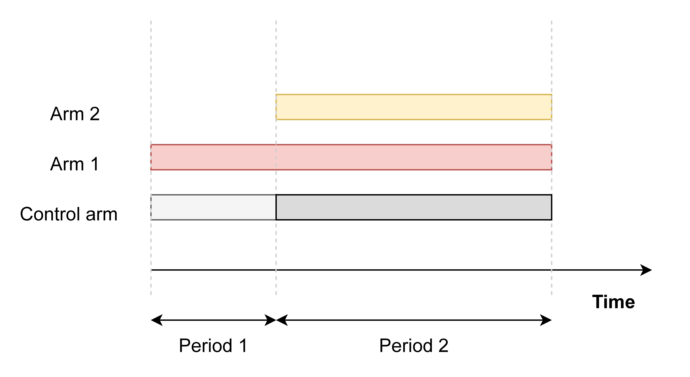

```{r setup, include=FALSE}
knitr::opts_chunk$set(echo = TRUE)
```


This repository contains the main code and R functions to reproduce the results of the simulation study in ``On model-based time trend adjustments in platform trials with non-concurrent controls'' (XXX).

We investigated frequentist, model-based approaches to adjust for time trends in platform trials utilizing non-concurrent controls. We investigated conditions under which the model-based approaches can successfully adjust for time trends for the simple case of a two-period trial with two experimental treatments and a shared control. We focus on a platform trial  with two treatment arms and a common control arm. Assuming that the second treatment arm is added at a later time period, we assess  the robustness of recently proposed model-based approaches  to adjust for time trends when utilizing non-concurrent controls. The following figure illustrates the design considered:


{width=30%}

Outline structure repository.


## Main simulation script:

- **mainpaper_script.R**: Script with all scenarios considered in the study. Simulates given scenarios and saves the results as .csv files in the folder _results_. 

...


## Example??

This is an R Markdown format used for publishing markdown documents to GitHub. When you click the **Knit** button all R code chunks are run and a markdown file (.md) suitable for publishing to GitHub is generated.

... Including Plots

You can also embed plots, for example:

```{r pressure, echo=FALSE}
plot(pressure)
```

Note that the `echo = FALSE` parameter was added to the code chunk to prevent printing of the R code that generated the plot.
